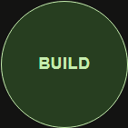

# Context-sensitive Build / Add to Queue

Implemented in G:/codebase/wasteland-workshop for review before v1.0.0-alpha.1. No version bump, tag or release publication was performed.

## Behavior and safety

Blueprint Details uses the actual Work Queue passed from App through both master search and collection views. The shared hasActiveQueueEntries helper recognizes Enqueued (the application's Pending status), Paused and Working. Completed records do not block immediate Build.

An empty unfinished queue displays the existing green circular Build button and starts the newly created Activity. A nonempty unfinished queue displays a rust/orange circular Add to Queue button with a centered cream label; it appends an idle Enqueued Activity. Location and dimensions are preserved, including the 88px mobile button. Existing working/paused timers, deadlines, ordering, costs and configuration remain unchanged.

Both Blueprint creation and Action creation use the same centralized detection and existing creation/persistence services. The enqueue service checks the authoritative queue supplied by useBuildQueue.apply at confirmation time, rather than trusting the earlier rendered label. No redundant queue state is stored. A shared submission guard rejects reentrant and repeated successful submissions for 750ms while navigation settles. Failed validation/storage submissions remain immediately retryable; later intentional additions are allowed.

Existing Blueprint recipe/economics snapshots and Action required fields/session validation remain in place. No new configuration or quantity system was introduced. Timer gesture implementation was not changed. The guided tour now describes both button modes.

## Files changed

- src/App.tsx: real queue props and shared Blueprint/Action submission guard.
- src/features/blueprints/BlueprintDetails.tsx, BlueprintSearch.tsx, WorkshopView.tsx: queue-aware presentation in master and collection details.
- src/features/builds/BuildQueueService.ts: centralized unfinished queue detection and enqueue-time reuse.
- src/features/builds/SubmissionGuard.ts: repeated submission prevention.
- src/features/actions/ActionService.ts: shared detection, retaining configuration validation.
- src/styles/controls.css: canonical rust circle variant, hover/pressed conventions.
- src/features/tours/TourRegistry.ts: accurate Build/Add to Queue narrative.
- src/features/builds/BuildQueue.test.ts: ten additional cases.
- tools/ui-queue-mode-check.py: five-state desktop/mobile workflow and screenshot checks.
- tools/ui-visual-check.py, tools/ui-tour-check.py: normalize only displayed release text for stable screenshot comparisons across versions.
- tests/visual/baselines: reviewed Blueprint and onboarding comparisons. Tiny menu border rasterization differences were inspected; unrelated screens remained unchanged.
- docs/context-sensitive-queue.md and docs/queue-mode-screens: report and screenshots.

## Screenshots

Green Build with an empty queue:

Orange Add to Queue with unfinished work:

Full desktop/mobile screen captures are included alongside the button captures in queue-mode-screens.

## Verification and readiness

410 tests across 30 files pass (10 new). New cases cover labels for every unfinished status, empty/completed-history transitions, immediate start, unchanged existing entries/order, confirmation-time state checks, timer persistence, economics/recipe retention, Actions and submission guard retry/duplicate handling. Existing alarm and timer tests remain passing. Lint, TypeScript and production build pass.

Isolated Chromium desktop 1280x900 and mobile 390x844 workflows verify all five queue states, real double clicks creating only one Activity, existing timers/order preserved, immediate Build, tap pause/resume, reload persistence and long press into Timer settings. Existing mobile-width workflows cover settings, queue/history, exports/restores, searches and Action creation. All ten guided tours remain passing. The 34 theme comparisons and 8 tour comparisons were reviewed and verified.

No blocking defect found for this change. This scope appears ready for v1.0.0-alpha.1 after a physical phone smoke test of tap/long press and alarms. Mobile verification uses Chromium emulation, not physical hardware. This does not certify unexamined release scope or deployment infrastructure. The application's existing foreground-only alarm limitation remains unchanged.
