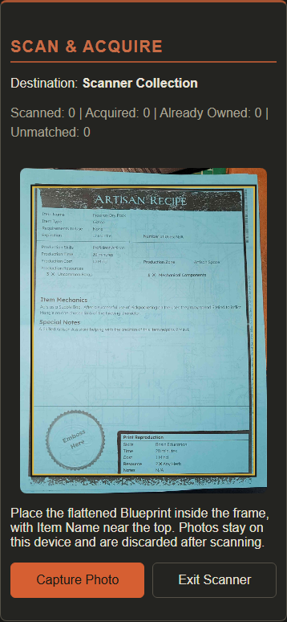
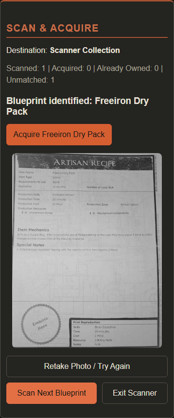
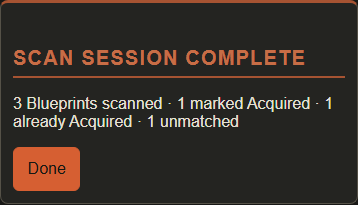

# Mobile Blueprint Scanner — Batch Scan & Acquire

Implemented locally in G:/codebase/wasteland-workshop. No release publication, tag, issue closure or deployment performed.

## Use

Choose an active collection in Blueprint Collections, then select Scan & Acquire. The destination is displayed throughout. Allow camera access, move closer and center the complete Item Name in the wide strip (the label is optional), and Capture Photo. Review the catalog match, then Acquire. Scan Next Blueprint reuses the open camera and OCR worker; it does not reopen permissions or navigate to the catalog. Already Acquired records do not duplicate entries. Retake retries the same document. Exit Scanner stops the camera and shows counters; Done returns to collections.

On a phone use an HTTPS URL. Plain HTTP to a computer's LAN address does not satisfy the secure-context requirement; desktop localhost is the development exception. Camera access is requested only after opening the scanner. Missing APIs, denied permission, busy/interrupted camera, missing destination and OCR/storage errors have explanatory messages. Backgrounding stops the camera and invalidates pending recognition; Resume Camera resumes explicitly. Confirmed acquisitions are already persisted if the tab closes.

## Architecture and privacy

- src/features/scanner/BlueprintScanner.tsx and CSS: batch workflow, guarded capture/acquisition, counters, error handling and summary.
- src/components/CameraPreview/: reusable live preview and wide name-only live viewfinder and centered 90% capture frame. object-fit:cover projects the same 3.4:1 strip used by capture in portrait or landscape. Lightweight 2Hz local luminance/contrast/movement guidance does not perform live OCR or block capture.
- ScanOcr.ts: lazy Tesseract.js 7.0.0, one Web Worker per session, local English int8 model, capture just the visible name strip, request higher camera resolution and best-effort continuous focus, bound capture width at 2200px with at most 2× upscaling. Use sparse/single-line OCR on the original strip, contrast-normalized block/single-line passes and bounded -5/+5 degree retries. At most six passes; no full-page fallback. Word-supported fallback suggestions remain uncertain and require a choice before Acquire. Canvas memory is released after each operation; model initialization/recognition runs off the UI thread.
- ScanMatching.ts: bounded text parsing and canonical catalog matching. ScanSession.ts owns session counters and destination checks.
- BlueprintCollectionService.ts: shared membership mutation used by existing status badges and the scanner; preserves collection and entry metadata.
- BlueprintCollectionsView.tsx and App.tsx: entry point, fixed destination identity, canonical ID validation, current stored destination/membership check, existing repository persistence before publishing success.
- vite.config.ts, package.json and package-lock.json: pinned local OCR assets served during development and emitted into production, with runtime licenses. No image/API server is required.

Photographs are temporary in-memory inputs. They are not uploaded, logged, written to local storage, added to backups or collected for analytics/training. Only normal collection membership changes persist. Explicitly supplied development photos live in tests/fixtures/scanner; no production fixture endpoint or automatic collection is added. These photographs were tested, not used to train a model.

## OCR selection, size and offline limits

Tesseract.js provides browser-side WebAssembly OCR in a worker, avoids API keys/cloud photo transfer and supports local worker/core/language paths. Alternatives such as cloud OCR conflict with the local-first requirement; platform text detection APIs do not provide a dependable cross-browser baseline. Sources: [Tesseract.js](https://github.com/naptha/tesseract.js), [local asset installation](https://github.com/naptha/tesseract.js/blob/master/docs/local-installation.md), [camera secure context and facingMode](https://developer.mozilla.org/en-US/docs/Web/API/MediaDevices/getUserMedia).

OCR is loaded only on first Capture. The lazy wrapper is about 17.2KB (7.3KB gzip). The English compressed model is 2.95MB, worker 111KB, and the selected embedded LSTM core about 3.9MB before HTTP compression. All supported SIMD/non-SIMD variants are shipped, but the device requests only one core. Full OCR asset distribution is approximately 48MB uncompressed on disk. Production smoke testing requested only local worker.min.js, one core and eng.traineddata.gz. Static files can be compressed/cache-served by hosting.

Recognition itself needs no network/API once the session engine has loaded. Guaranteed cold-start offline scanning is not claimed: the application does not yet have a PWA service worker that precaches its shell and OCR assets. Future PWA work should precache the lazy engine, selected core and English model without caching user captures. Current sessions use no persistent photograph cache.

## Match confidence

Normalize case, whitespace, punctuation, diacritics and joined words. Exact normalized catalog names rank first; common 0/O and 1/I/l confusions receive a 0.96 score. Otherwise use normalized Levenshtein similarity. Fuzzy names under five characters are rejected, candidate lengths are bounded, and similarity below 0.86 is discarded. A single exact name or a best score at least 0.94 with at least a 0.08 lead is high confidence. Other plausible results are ambiguous and require selection; display at most five candidates. No result creates a Master Catalog record. Acquire always requires an explicit click even for high confidence.

## Initial implementation evidence and limitations (historical)

The two supplied real photographs matched Freeiron Dry Pack (catalog ID 5234) and Hooch (4407), both exact/high confidence: 2/2 original photos. With derived 5-degree rotation and dim-light variants, all 6/6 test inputs matched the expected Blueprint. Before the bounded angle retry, rotated Freeiron failed safely; that informed the retry implementation. These are two distinct documents, not a representative general success-rate claim. Desktop timings in the recorded run were 559ms first scan including model initialization, 538ms rotated Freeiron, and 291–346ms for remaining warm scans. See scanner-screens/sample-results.json.

No physical Android/iOS phone has been tested by the agent. Chromium desktop/mobile emulation verifies layout/workflows, not real camera lens selection, permissions, memory pressure or phone speed. Target current Android Chrome and iOS Safari with HTTPS, getUserMedia, Canvas, Web Workers and WebAssembly; runtime checks decide availability. Physical-device camera and performance acceptance remains open. Severe perspective, major rotation, glare, blur and damaged prints may require retakes. No automatic edge detection, full perspective correction or learned model is implemented. Hundreds-of-document memory behavior needs a real-device soak test.

Counters count processed documents; retakes replace the current document outcome. Unmatched includes failed, skipped or unconfirmed documents. Successful acquisitions and already-owned results are distinct. Counters are session-only and not backed up.

## Initial implementation verification (historical)

429 tests in 31 files pass, including 18 new scanner tests. Full release-tooling tests, lint, TypeScript and production build pass. Existing mobile workflows, all ten tours, queue/timer checks and 42 earlier visual comparisons pass. Six new reviewed scanner screenshots cover camera, result and summary on desktop/mobile; ambiguous presentation is reviewed separately. Real local OCR integration verifies explicit acquisition, double-click protection, metadata preservation, already-owned batch scans, no-match/retake counters, reload/reopen, background recovery, camera release and same-origin requests. Controlled integration also verifies ambiguity, OCR failure, storage failure, changed/deleted destinations, unsupported API and denied permission. Production bundle smoke testing recognizes and acquires a reference Blueprint using only built local assets.

Run scripts/run-all-tests.ps1, npm run lint, npm run build, python tools/ui-functional-check.py, python tools/ui-tour-check.py, python tools/ui-queue-mode-check.py, python tools/ui-scanner-check.py and python tools/ui-scanner-samples.py with Vite at 127.0.0.1:5186. Reference sample results and screenshots are review artifacts, not application data.

## Physical-phone sign-off checklist

On HTTPS, test Android Chrome and iOS Safari: grant/deny permissions; verify rear camera; scan both reference documents plus at least 20 varied prints; exercise ambiguous/unmatched results and existing membership; rotate portrait/landscape; background/resume; acquire/reload; confirm camera privacy indicator turns off on exit; measure first/warm latency and memory over 100 captures. Check the browser console/network panel for unexpected endpoints. Record device/OS/browser and results. Until this is done, the implementation is available for testing but the real-device acceptance criterion is not complete.

## Name-focused improvement (2026-10-09)

Replaces whole-page framing after reported mobile failures. Capture the full name in the upper-left Item Name row; the label is optional. The live viewfinder now shows only this wide strip, making close-up alignment and keeping mobile Capture accessible easier. Static examples use developer fixtures, not a live phone.

More light needed / little text contrast / hold still guidance comes from a temporary 192×56 sample every 500ms. It is advisory, not a blur measurement or promise that OCR will succeed. It never locks Capture or automatically acquires a Blueprint. No camera autofocus capability is assumed; failure to apply supported continuous focus leaves normal capture working.

OCR retains raw-image passes before contrast normalization. Name-before-label ordering on tilted paper is supported. Word-confidence filtering or an exact catalog fragment surrounded by OCR noise may discard a meaningful qualifier, so those candidates are always uncertain and never promoted to an automatic high-confidence selection. Captured pixels and a bounded read-text snippet help diagnose failed/uncertain results; neither persists.

470 tests pass (15 new tests for light/contrast/movement, crop geometry/resolution, parser ordering, raw single-line pass, bounded retries, uncertain word/fragment suggestions and cleanup). Actual local OCR fixture tests cover ten cases from the two supplied photographs: normal, +5°, -5°, 40% brightness and name-value-only. Nine exact high-confidence matches, one uncertain correct Hooch candidate for explicit selection. These are transformed reference cases, not ten independent photos, and do not establish a real-world success rate. Current results: scanner-screens/name-focused-results.json. Source crop coordinates exist only in the fixture test, not in production.

Desktop/mobile browser checks cover actual OCR, batch counts, retakes, repeated ownership, metadata persistence, same-origin requests, background/resume, camera cleanup, unsupported/denied cases, changing light feedback and rejected autofocus constraints. Review the updated camera/result screenshots and retest on the actual phone that reported one successful attempt in five. Heavy blur, glare, clipping and perspective distortion can still defeat recognition. No new dependency, cloud service, release or deployment.

Segmentation, contrast and skew approach follows Tesseract quality guidance: https://github.com/tesseract-ocr/tessdoc/blob/main/ImproveQuality.md and browser API support: https://github.com/naptha/tesseract.js/blob/master/docs/api.md.

Production preview verification passed with a name-value-only capture and local bundled OCR assets. The noisy capture produced an uncertain correct Freeiron Dry Pack candidate; explicitly choosing it and then Acquire persisted canonical ID 5234. No development source imports or external requests occurred.

Additional files changed for this improvement: `ScanQuality.ts`, `ScanQuality.test.ts`, `ScanOcr.test.ts`, `ScanMatching.ts`, `ScanOcr.ts`, `Scanner.test.ts`, `BlueprintScanner.tsx/.css`, CameraPreview code/CSS/geometry, both scanner browser tools, four individually reviewed camera/result baselines and documentation/evidence. Existing capture/session/destination tests remain passing.

### Landscape framing and camera light correction

The preview video/image now fills an explicitly sized landscape container without its intrinsic portrait dimensions stretching the viewfinder. Browser checks assert the actual rendered 3.4:1 geometry on desktop and mobile. Supported cameras expose a themed Camera Light toggle; it preserves existing constraints, verifies the resulting torch setting, and reports rejected/ignored changes. The light is optional and camera tracks are stopped on exit/background. Physical Android testing remains required.

### Diagnosing a failing phone scan

Before Capture Photo, expand Scan Diagnostics and enable Collect diagnostics for the next capture. After recognition finishes or fails, Download Scan Diagnostics saves a JSON file containing the lossless original OCR crop, each processed OCR image, full recognized text, word confidence, extracted name candidates, matching results, timings, app version, browser, preview bounds and camera resolution/settings. Camera identifiers and collection contents are excluded. The original capture remains available even if OCR initialization fails. Nothing is uploaded or persisted automatically; retake, exit or disabling diagnostics clears the report. Send the downloaded file for investigation rather than a screenshot of the preview. Diagnostics are opt-in; normal scans do not encode/store per-pass images.

Camera Light currently means continuous illumination. It is not a still-photo flash; native capture flash needs a separately supported still-photo capture path.

### Still-photo capture and focus feedback (2026-10-09)

A physical Android diagnostic showed a well-framed but visibly soft 1728×508 name strip; all six OCR passes completed, recognizing mostly nothing. Full video resolution and continuous autofocus had not ensured a focused capture. Native ImageCapture.takePhoto is now preferred when available. A Flash toggle is shown only when getPhotoCapabilities explicitly advertises capture flash. Selecting it does not illuminate the preview; flash is requested only when Capture Photo is pressed. Continuous torch control has been removed. Native capture failures fall back to video when flash is off, recording the reason in diagnostics. Requested flash failures remain explicit errors, never silently replaced by a non-flash frame.

The still is center-cropped to the preview aspect before applying the name-strip rectangle, then capped at 2200 pixels without upscaling. This assumes the same centered camera field of view; devices may use a different still lens/crop and physical testing remains required. Decoded bitmaps close on success, error or late cancellation. Autofocus requests preserve existing constraints.

Enlarge name to check focus offers a horizontally scrollable 2× view of the full strip, live and captured. An advisory normalized edge-energy score sampled at 768 pixels warns for soft/low-detail captures without blocking OCR. This is a heuristic, not a focus-lock guarantee; blank, low-contrast or sparsely printed strips can also trigger it. Diagnostics record capture source, source dimensions, sharpness and native fallback reason. The previous failed sample scored approximately 0.0065 in a Pillow reproduction, below the advisory 0.08 threshold; browser interpolation can differ. The existing blurry image cannot reliably be repaired into a legible photo.

Tests cover native flash-on capture, unsupported/failing still fallback, no silent flash fallback, crop alignment, late cancellation/bitmap cleanup, and soft-vs-sharp edge energy. Browser checks verify one-shot flash, magnifier mobile containment, actual diagnostic export, and retained acquisition/persistence/cleanup flows. Actual phone retesting is still required.

Primary API references: https://developer.mozilla.org/en-US/docs/Web/API/ImageCapture/takePhoto and https://developer.mozilla.org/en-US/docs/Web/API/ImageCapture/getPhotoCapabilities.

### Isolated name-row recovery (2026-10-09)

The two supplied still-photo diagnostics had readable names, but full-strip OCR emphasized distressed headers and paper texture. Local adaptive grayscale thresholding is now used to find up to three text-height bands after the two original fast passes fail. Small speckles and long rules are excluded from the row detector. Each band is tried with grayscale contrast over the inner page width, then a second-column local-background-removal retry. White padding is added after contrast calculation so it does not skew the statistics. The detector does not use a particular Blueprint name or hardcoded coordinates from the supplied photos. These template column assumptions may miss other layouts or clip long names; the original full-strip fallbacks remain.

The row retries use sparse-text segmentation and are bounded at six extra passes (12 overall maximum). They stop as soon as a candidate is available, and always require explicit selection/confirmation because row/column isolation can drop a qualifier. Matching thresholds and acquisition rules remain unchanged. Other labeled metadata rows are excluded from candidate extraction. Useful row text is shown in the uncertain result instead of the initial header noise. Every processed row image and its location/variant remains available in opt-in diagnostics; flashRequested and flashSupported are now recorded separately from torch state.

Replaying the exact original PNG captures from wasteland-scan-diagnostics (1).json and (2).json through the production scanner code offered canonical Slappi Revolver #5186 in both cases, with uncertain confidence. The first recovered from the grayscale row; the second recovered from local background removal. No new phone capture was needed for this verification. This proves recovery on these two supplied images, not a general success rate or actual flash firing.

Validation: 482 unit tests, lint/build, the existing ten-photo-variation corpus and desktop/mobile scanner workflow/visual checks pass. Five new tests cover rejection of other metadata fields, illumination/color removal, speckle/rule rejection, bounded row detection, and confirmation-only recovery/cleanup. Replay tool: python tools/ui-scanner-diagnostics.py --expect "Slappi Revolver" <local diagnostic files>. Diagnostic photos are not copied into the repository or uploaded.

### PaddleOCR primary engine comparison (2026-10-09)

The scanner now tries PaddleOCR.js 0.4.2 with PP-OCRv5 mobile detection/recognition models before the existing Tesseract engine. This is a different OCR engine, not another Tesseract wrapper. ONNX Runtime Web 1.24.3 is pinned to match the SDK worker runtime. The SDK runs in an explicitly owned module worker using single-thread WASM, requiring neither WebGPU nor cross-origin isolation headers. Leaving/backgrounding terminates the worker immediately. Lazy initialization means normal app pages do not load Paddle/OpenCV/models.

Models, runtime and worker files are hosted by the app under /ocr-paddle/. The app makes no inference API calls, image uploads or model-CDN requests. The pinned model source URLs, byte counts and SHA-256 hashes are recorded in public/ocr-paddle/manifest.json; licenses are supplied alongside the assets. The larger asset load is a material tradeoff: roughly 21.5 MB of model archives plus the ONNX WASM and OpenCV/SDK scripts (about 65 MB before HTTP compression). The first scan needs those host assets; reliable cold offline use still requires future PWA caching. Actual phone speed/memory performance remains unverified. The initial desktop trial spent approximately 1–3 seconds per prediction after initialization, and integrated cold scans took approximately 2.5–4.7 seconds before any Tesseract fallback.

Paddle line polygons associate the name with its Item Name label, keeping production/resource fields outside that selection. Without a readable label, only lines above the next known field are considered and candidates remain uncertain. Existing matching thresholds and explicit acquisition rules are preserved. If Paddle cannot match a name or its runtime fails, the existing local Tesseract/isolated-row engine runs as fallback. Diagnostics record each engine, recognized lines, detection polygons and primary initialization/inference errors.

Comparison on the three provided diagnostic PNGs: Paddle read Slappi Revover, Slappi Revoher, and Slappi Revover, respectively. The first and third yielded the correct uncertain candidate directly. The second spelling was outside the existing matching threshold, so the retained Tesseract fallback supplied the correct uncertain Slappi Revolver #5186 candidate. All three integrated replays therefore offered the correct Blueprint; this is a three-image result, not a phone-wide success-rate claim. The original blurry video image now has a usable suggestion without new photo capture.

Validation: 489 tests, lint and production build; ten existing photo variations (eight confident, two name-only confirmation cases); desktop/mobile scanner checks and same-origin network verification. New tests cover primary/fallback choice, name-field association, uncertain context-free/fuzzy readings, local single-thread asset configuration, error diagnostics, and closing before/during initialization. A production preview check covers actual Paddle OCR, diagnostic download, canonical collection persistence, cleanup, no source imports, and no external requests.

Files: ScanRecognition.ts/test, scanner wiring and diagnostic types, Vite asset hosting, pinned package/lock changes, public/ocr-paddle models/licenses/manifest, replay and browser-check tools. Source: https://www.paddleocr.ai/latest/en/version3.x/inference_deployment/cross_platform/browser.html. Scribe.js was considered but was not used as the independent-engine comparison because its built-in browser engine remains Tesseract-based.

### Production MIME failure diagnosed (2026-10-09)

A desktop Chrome diagnostic from version 0.9.14 showed that PaddleOCR never initialized: its dynamic ONNX module import failed. The live `.mjs` URL returned HTTP 200 with `application/octet-stream`, which browsers reject for ES modules. This was a hosting configuration defect, independent of camera quality. That capture used 2560×1440 pixels; the fallback eventually read Slappi Revolver exactly and offered it for confirmation.

The Docker image now installs `nginx.conf`, which explicitly serves `.mjs` files as `application/javascript`. Other assets keep nginx's existing MIME mappings. Missing modules return 404. This requires rebuilding and deploying the container; a browser refresh alone cannot fix the old image.

Verification: nginx configuration validation passed, the module returned the correct JavaScript MIME type, and the real production scanner workflow passed through an isolated nginx container (PaddleOCR, same-origin assets, diagnostic export, acquisition persistence, and camera cleanup). `tools/ui-scanner-production-check.py` accepts `SCANNER_TEST_URL` to test the actual hosting container rather than only Vite preview.

### Reduced-scale retry for webcam captures

A 0.9.15 desktop diagnostic read the name as disconnected `Frccironl` and `Hokba` on the original 2200-pixel crop. Replaying the same capture in grayscale with 1.4 contrast at 800 pixels read `Freeiron Hawkbi`, enough to offer Freeiron Hawkbill under the unchanged catalog thresholds. The scanner now makes one bounded reduced-scale retry only after an unmatched original pass. Retry results always require confirmation; both inputs and detections are included in opt-in diagnostics, and temporary canvases are released.

The latest cleaned-camera capture now offers the correct blueprint. The preceding capture (read as `Freeiron Hawkba`) still fails; this is an improvement, not a guarantee for every soft image. No diagnostic photos are added to the repository or uploaded. Regression coverage checks reduced-scale fallback and confirmation, alongside existing matching safety and worker cleanup tests.

### Focus controls and diagnostics

The scanner now records camera-supported focus modes and manual-distance range, the requested autofocus mode, request success/failure (including error text), and actual mode/distance when the browser reports them. No camera IDs are recorded. Initialization requests continuous autofocus where available, otherwise single-shot. Unsupported and manual-only cameras keep their default behavior.

A themed Refocus button appears only when single-shot or continuous autofocus is advertised. It prefers single-shot on explicit request, otherwise reapplies continuous mode. Capture is disabled while the request is pending. Feedback confirms only that the request was accepted, never a focus lock; the browser does not provide a portable focus-lock signal. Rejected requests get visible feedback and remain in diagnostics. Late results are ignored after camera interruption or replacement. Manual focus sliders and automatic focus-distance sweeps are not implemented.

Validation: six focus unit tests cover supported modes, actual settings, explicit single-shot, continuous fallback, unsupported/manual-only devices, rejected requests and unavailable capability reporting. 496 tests, lint and build pass. Desktop/mobile scanner workflows (including rejected Refocus feedback) and the production workflow pass. Reviewed new desktop/mobile screenshots; existing visual baselines were preserved because the new control deliberately changes the camera view. Physical camera behavior still requires phone/webcam testing.

### Mobile cleanup, loading feedback and automatic capture

The scanner now shows a compact destination/counter header, camera, capture controls and short guidance. The global Settings > Blueprint Scanner > Scan Diagnostics preference is Off by default and persists through the guarded local settings store. When Off, no diagnostics disclosure, collection checkbox, raw OCR output or download control is rendered, and diagnostic PNG passes are not generated. On restores the opt-in capture/export controls. This troubleshooting preference is local to the device; it does not add captured photos or a diagnostic report to portable backups.

A reusable LoadingIndicator control displays a rotating circle and “Loading OCR Library” while the local PaddleOCR models/runtime initialize. It disappears when initialization settles; manual capture retains the existing Tesseract fallback and its loading feedback. Reduced-motion users receive a static status indicator. Capture is disabled during initialization. Models initialize only after opening the scanner, never from ordinary catalog navigation.

The preview samples an 800-pixel name strip at most once every 1.8 seconds after the prior prediction completes. Actual detected text polygons appear in translucent yellow over the corresponding preview area, with separate mapping for captured-image detections. Predictions are serialized with full-resolution capture recognition, previews do not run Tesseract fallback, and sampling stops while capturing/reviewing, focusing, hidden or exited. Close ignores late results and releases the camera/worker. Highlights indicate detected text, not confirmed catalog identification; they can lag camera movement between samples.

Auto Capture defaults On for each scanner session. Two consecutive preview samples must agree on the same unique exact catalog name (score 1); fuzzy readings, missing names and duplicate exact catalog entries do not trigger a shutter. A full still-photo capture and the existing recognition/confirmation flow follow. No acquisition is automatic: the user must confirm Acquire. Sampling pauses until Retake or Scan Next Blueprint. Auto Capture can be switched Off, and Capture Photo remains available for manual use. Matching already normalizes both OCR and catalog names with toLowerCase; an explicit mixed-case comparison regression was added.

“Where to aim” opens an existing real Freeiron Dry Pack photo with a yellow box around its Item Name row. It is collapsed initially to keep the mobile scanner compact; the bitmap itself is unchanged.

Validation: 507 unit tests, lint and production build; real desktop/mobile automatic capture, manual scanner safety/acquisition and opt-in diagnostics workflows, hidden diagnostics/default preference persistence, live text polygons, loading state, guide image, no preview acquisition, no horizontal overflow and production same-origin OCR checks. Review screenshots are written to tests/visual/actual. Four changed desktop/mobile camera/result baselines were individually reviewed and updated; summary baselines were preserved. Phone performance/battery behavior with interval OCR still needs physical-device testing.

### Clear acquisition badges and centered progress

LoadingIndicator now fills its scanner result row and centers both ring and notice. Confident detections use the existing green status-badge appearance for `Acquire [print name]`; uncertain suggestions use the existing yellow appearance and the instruction “Check the name, then tap Acquire to import the correct print.” Tapping a yellow candidate now explicitly acquires that named candidate in one action, instead of requiring a name-selection tap followed by a second Acquire tap. Recognition alone still never changes the collection. Existing owned, destination-change and save-failure handling remains intact.

Badges are constrained to the available width (up to 24rem). The name ellipsizes while the Acquire verb stays visible; the complete action/name remains in aria-label and title. Desktop/mobile workflow checks cover confidence colors, direct acquisition, storage failures and long-label ellipsis without horizontal overflow. Loading alignment is checked against the result-row center.
